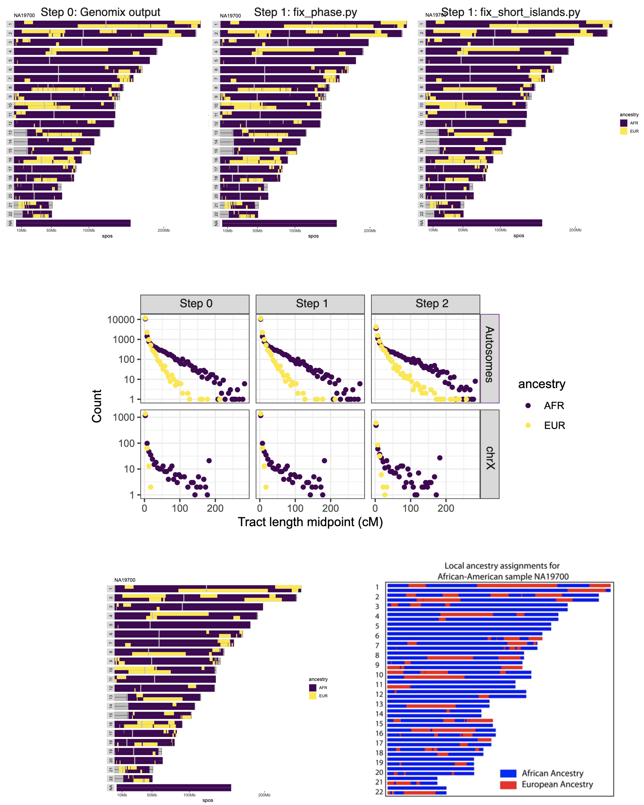

# Heuristic tracts smoother

Two-pass cleanup of local-ancestry tracts:

1. Phase-fix short discordant windows between haplotypes.
2. Island smoothing of very short tracts that fragment long runs.

```bash
# ASW samples
 cat integrated_call_samples_v3.20130502.ALL.panel | grep ASW | cut -f1 >ASW_samples.txt
```


### Steps

#### 1) Phase-fix

Here very obvious phase errors are fixed. 

- Exact coordinate matches (chm, sgpos, egpos)
- Discordant ancestry, short window (≤ 2.0 cM)
- Swap if immediate continuity improves

#### 2) Island smoothing

- Flip short tracts (< 1.0 cM) if:
    * left edge supported (next tract ≥ 2.0 cM), or
    * middle island flanked by matching ancestries, or
    * right edge supported (prev tract ≥ 2.0 cM)


 - [Gnomix output bed files for ASW](data/asw_subset/)
 - [Fix phase](data/corrected_phase/)
 - [Fix short islands](data/corrected_phase_island/)


